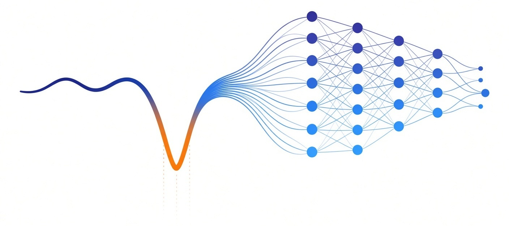

<div align="center">

[English](README.md) | **中文**



### 气体传感领域的 MNIST

**面向光学光谱学的开源仿真引擎与机器学习基准**<br>
*HITRAN 级物理精度。可复现数据划分。9 项任务。超越基线模型。*

<br>

[](https://colab.research.google.com/github/spektran/spektran/blob/main/notebooks/quickstart_colab.ipynb)
[](https://github.com/spektran/spektran/stargazers)
[](https://github.com/spektran/spektran/actions/workflows/ci.yml)
[](https://pypi.org/project/spektran/)
[](https://pypi.org/project/spektran/)
[](LICENSE)
[](LICENSE-DATA)
[](https://doi.org/10.5281/zenodo.21790394)

[**文档**](https://spektran.github.io/spektran/) &nbsp;&middot;&nbsp;
[**在线演示**](https://huggingface.co/spaces/spektran/spektran-demo) &nbsp;&middot;&nbsp;
[**排行榜**](https://spektran.github.io/spektran/leaderboard/) &nbsp;&middot;&nbsp;
[**数据集**](https://huggingface.co/datasets/spektran/spektran-ch4-v0) &nbsp;&middot;&nbsp;
[**基线模型**](https://huggingface.co/spektran/spektran-baselines-v0)

</div>

<br>

> **你不需要是光谱学专家。** &nbsp;无论你从事回归、去噪、领域泛化还是异常检测研究，SPEKTRAN 都能提供 9 项开箱即用、基于真实物理构建的基准任务——具备 MNIST 般的易用性，却扎根于一个机器学习能够产生直接产业影响的真实领域。

<br>

## 核心亮点

<table>
<tr>
<td width="50%" valign="top">

### 仿真引擎
- **10 种气体分子** — CH4、H2O、CO2、CO、NH3、NO、NO2、SO2、HCl、HF
- **2 种检测模态** — TDLAS（DA + WMS）与 NDIR
- **先进线型** — Voigt 线型与 Hartmann-Tran 线型
- **14+ 种虚拟仪器**，配备真实噪声链路
- **WMS 1f–4f** 解调 + 2f/1f 免标定比值法

</td>
<td width="50%" valign="top">

### 机器学习基准
- **9 项任务（T1–T9）** — 回归、去噪、OOD、迁移、多组分
- **12+ 种基线模型** — Ridge、CNN、Transformer、U-Net、TCN
- **官方数据划分** — 训练集 / 验证集 / 测试集 / 留出仪器集
- **一条命令完成评测**，通过 `spektran benchmark`
- **公开排行榜**，托管于 GitHub Pages

</td>
</tr>
</table>

<br>

## 快速开始

**零安装** — 一行代码即可从 Hugging Face 加载数据：

```python
from datasets import load_dataset
ds = load_dataset("spektran/spektran-ch4-v0")
```

**完整引擎** — 在本地模拟光谱：

```bash
pip install spektran
```

```python
from spektran.physics import simulate_absorbance

nu, absorbance = simulate_absorbance(
    molecule="CH4", concentration_ppm=100.0,
    temperature_K=296.0, pressure_atm=1.0,
    path_length_m=10.0,
    wavenumber_start_cm1=6046.0, wavenumber_end_cm1=6048.0,
)
```

<details>
<summary><b>更多示例</b> — WMS、多组分、命令行工具</summary>

<br>

**WMS 2f 信号：**

```python
from spektran.physics.wms import WMSConfig, simulate_wms
```

完整 WMS 示例见 [`examples/wms_ch4.py`](examples/wms_ch4.py)。

**多组分（CH4 + H2O 干扰气体）：**

```python
from spektran.physics import absorption_coefficient
from spektran.physics.hitran import demo_ch4_2nu3, demo_h2o

alpha_ch4 = absorption_coefficient(nu, demo_ch4_2nu3(), 100e-6, 296.0, 1.0)
alpha_h2o = absorption_coefficient(nu, demo_h2o(), 0.01, 296.0, 1.0)
```

详见 [`examples/multispecies_ch4_h2o.py`](examples/multispecies_ch4_h2o.py)。

**命令行工具：**

```bash
spektran generate configs/datasets/ch4-t1-train-v0.yaml --out data
spektran benchmark --task T1-concentration --truth data/test.h5 --predictions preds.csv
```

</details>

<br>

## 基准任务

| 任务 | 领域 | 主要指标 |
|:-----|:-------|:---------------|
| **T1** 浓度回归 | DA 光谱 → ppm | MAE |
| **T2** 光谱去噪 | 含噪光谱 → 干净光谱 | RMSE |
| **T3** 跨仪器泛化 | 留出仪器 | 相对 T1 的性能衰减 |
| **T4** WMS 浓度反演 | 2f 信号 → ppm | MAE |
| **T5** 漂移补偿 | 时间序列扫描 | 阿伦方差 |
| **T6** OOD 仪器检测 | 分布内 vs OOD | AUROC |
| **T7** 跨模态迁移 | TDLAS → NDIR | 相对 T1 的性能衰减 |
| **T8** 多组分回归 | CH4 + H2O → 双组分 ppm | 综合 MAE |
| **T9** 温度回归 | 光谱 → 气体温度（K） | MAE |

<br>

## 排行榜

**T1 浓度回归 + T3 跨仪器泛化**（v0 数据划分，CH4 DA）：

| 模型 | T1 MAE ↓ | T1 MAPE ↓ | T3 MAE ↓ | T3 性能衰减 |
|:------|:--------:|:---------:|:--------:|:--------------:|
| 岭回归（Ridge Regression） | **2.84** | 29.9% | **3.72** | **1.31x** |
| 分块 Transformer（Patchified Transformer） | 7.39 | **22.7%** | 10.81 | 1.46x |
| 一维 CNN（1D CNN） | 15.58 | 42.2% | 28.30 | 1.82x |

> 模型复杂度与仪器过拟合程度呈正相关：Ridge 1.31x → Transformer 1.46x → CNN 1.82x。你能否构建一个打破这一规律的模型？

<details>
<summary><b>其他任务结果</b></summary>

| 任务 | 最佳模型 | 得分 |
|:-----|:-----------|:------|
| **T2** 去噪 | 一维 U-Net（1D U-Net） | RMSE 3.62e-3 |
| **T4** WMS | Ridge | MAE 15.15 ppm |
| **T5** 漂移 | 移动平均（Moving Average） | MAE 0.270 ppm |
| **T6** OOD | PCA + 马氏距离（Mahalanobis） | AUROC 0.672 |
| **T7** 跨模态 | Ridge（TDLAS→NDIR） | MAE 130.68 ppm（46x） |
| **T8** 多组分 | Ridge（双通道） | CH4 0.89 / H2O 3937 ppm |
| **T9** 温度 | Ridge | MAE 9.4 K |

</details>

[**完整排行榜 →**](https://spektran.github.io/spektran/leaderboard/) &nbsp;&middot;&nbsp;
[**提交结果 →**](https://spektran.github.io/spektran/leaderboard/#submitting-results)

<br>

## 真实场景应用

SPEKTRAN 的基准任务对应着工业和环境科学中的真实问题：

- **甲烷泄漏检测** — 油气设施、垃圾填埋场、畜牧业（T1、T3）
- **工业排放监测** — SO2、NO、CO 烟气连续分析（T4、T8）
- **医学呼气分析** — ppb 级痕量气体生物标志物检测（T1、T9）
- **仪器无关部署** — 模型跨硬件迁移，无需重新标定（T3、T7）
- **抗漂移野外传感器** — 恶劣环境下的长期自主监测（T5）

<br>

## 工作原理

```
 HITRAN line data        Instrument configs         Benchmark
 ───────────────        ──────────────────         ─────────
 Line positions    ──►  Virtual instruments   ──►  Official splits
 Line strengths         (noise, fringes,           (train/val/test/
 Broadening params       drift, chirp)              held-out)
        │                      │                       │
        ▼                      ▼                       ▼
   Forward physics  ──►  Noisy spectra   ──►   Evaluate & rank
   (Voigt / HTP)         with provenance       on leaderboard
```

<br>

## 值得信赖的物理基础

- **双实现交叉验证** — 独立的参考实现与 HITRAN/hapi 交叉校验
- **文献锚定噪声模型** — 仪器噪声参数调研自 18 篇已发表文献中的实测系统
- **仿真-真实差距报告** — 已知差距来源记录于 [G5 报告](gates/reports/)
- **自动化质量门禁** — G1–G5 检查点在 CI 中强制执行

<br>

## 引用

```bibtex
@software{spektran,
  title     = {SPEKTRAN: Simulation Engine and ML Benchmark for Optical Gas Sensing},
  url       = {https://github.com/spektran/spektran},
  doi       = {10.5281/zenodo.21790394},
  version   = {0.5.0},
  license   = {Apache-2.0}
}
```

详见 [CITATION.cff](CITATION.cff)。Zenodo DOI：[10.5281/zenodo.21790394](https://doi.org/10.5281/zenodo.21790394)。

## 贡献指南

详见 [CONTRIBUTING.md](CONTRIBUTING.md)。我们欢迎新的基线模型、检测模态与谱线数据库方面的贡献。

<div align="center">
<sub>代码许可：Apache-2.0 &nbsp;·&nbsp; 数据与模式许可：CC BY 4.0</sub>
</div>
